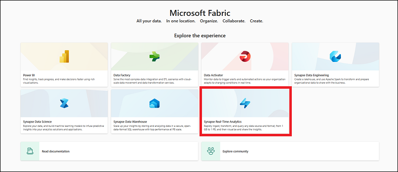
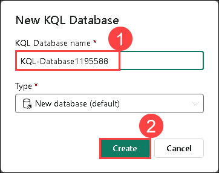
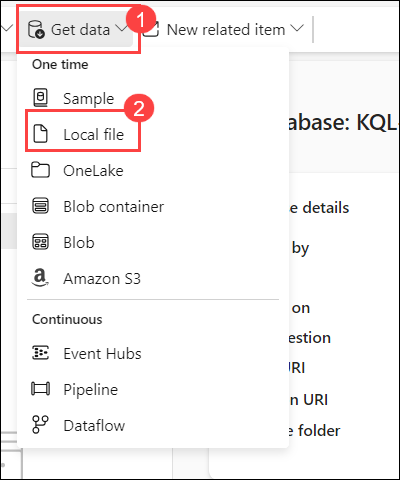
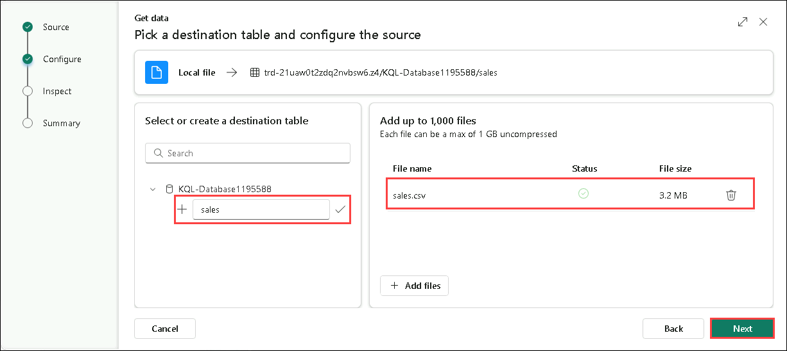
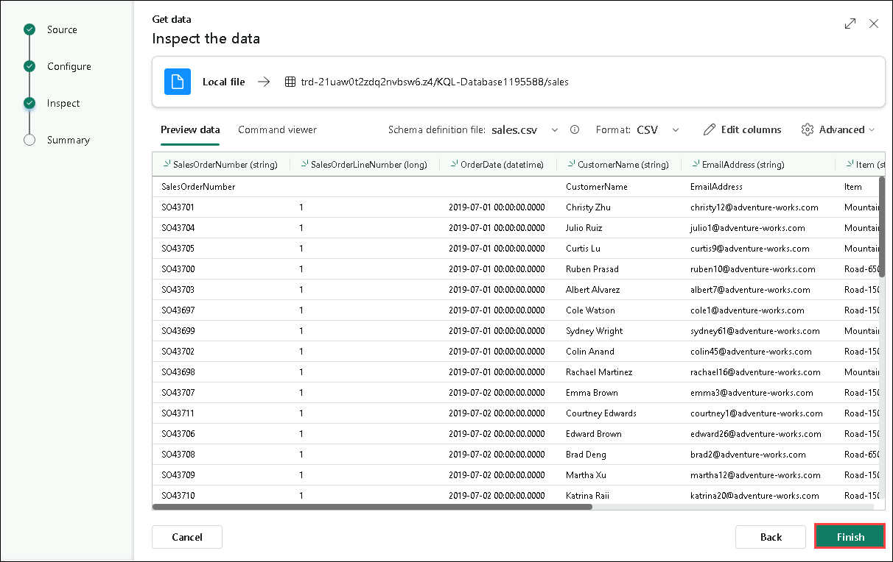
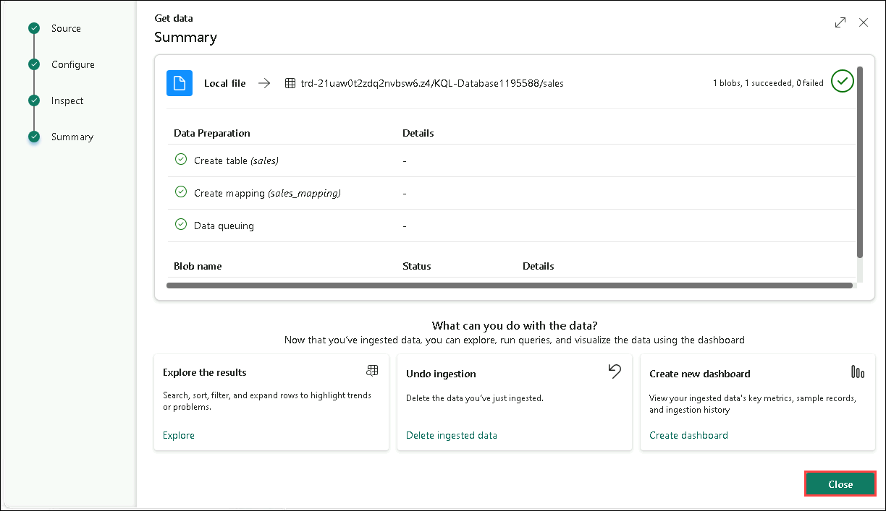
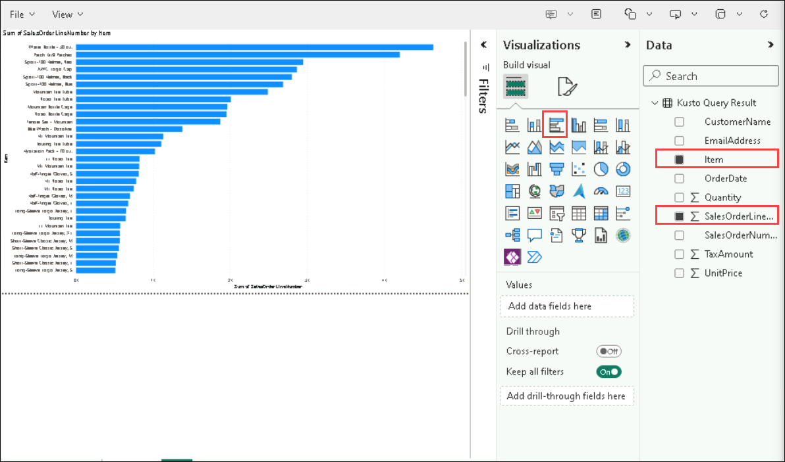

# Exercise 4: Get started with Real-Time Analytics in Microsoft Fabric

### Estimated Duration: 45 minutes

Microsoft Fabric provides a runtime that you can use to store and query data by using Kusto Query Language (KQL). Kusto is optimized for data that includes a time series component, such as real-time data from log files or IoT devices.

Now that you have created a workspace in the previous step, it's time to switch to the *Synapse Real-Time Analytics* experience in the portal.

## Lab objectives

You will be able to complete the following tasks:

- Task 1: Create a KQL database
- Task 2: Use KQL to query the sales table
- Task 3: Create a Power BI report from a KQL Queryset
- Task 4: Use delta tables for streaming data
  
### Task 1: Create a KQL database

Kusto query language (KQL) is used to query static or streaming data in a table that is defined in a KQL database. To analyze the sales data, you must create a table in a KQL database and ingest the data from the file.

1. In the **Microsoft Fabric** experience portal, select the **Real-Time Intelligence** experience image as shown here:

    

2. Create a new **Eventhouse** with the name **Eventhouse-<inject key="DeploymentID" enableCopy="false"/>**.

3. Once the Eventhouse gets created, in the settings pane, create a **+ New Database** for the **KQL Databases**.

   - **Name:** Enter **KQL-Database<inject key="DeploymentID" enableCopy="false"/> (1)**.

   - Click on **Create (2)**.

     

4. When the new database has been created, select the option to **Get data (1)** from **Local file (2)**.

   

5. Use the wizard to import the data into a new table by selecting the following options:
    - **Source**:
        - **Database:** *The database you created is already selected*
        - **Table:** *Create a new table named* **sales**.
        - **Source type:** File
        - **Upload files:** Drag or Browse for the file from **C:\LabFiles\Files\sales.csv**

            

    - **Inspect:** Preview the data and click on **Finish**.

        

    - **Summary:**
        - *Review the preview of the table and close the wizard.*

            

> **Note:** In this example, you imported a very small amount of static data from a file, which is fine for this exercise. In reality, you can use Kusto to analyze much larger volumes of data; including real-time data from a streaming source such as Azure Event Hubs.

### Task 2: Use KQL to query the sales table

Now that you have a table of data in your database, you can use KQL code to query it.

1. Make sure you have the **sales** table highlighted. From the menu bar, select the **Query table** drop-down, and from there select **Show any 100 records**.

2. A new pane will open with the query and its result. 

3. Modify the query as follows:

    ```kusto
   sales
   | where Item == 'Road-250 Black, 48'
    ```

4. Run the query. Then review the results, which should contain only the rows for sales orders for the *Road-250 Black, 48* product.

5. Modify the query as follows:

    ```kusto
   sales
   | where Item == 'Road-250 Black, 48'
   | where datetime_part('year', OrderDate) > 2020
    ```

6. Run the query and review the results, which should contain only sales orders for *Road-250 Black, 48* made after 2020.

7. Modify the query as follows:

    ```kusto
   sales
   | where OrderDate between (datetime(2020-01-01 00:00:00) .. datetime(2020-12-31 23:59:59))
   | summarize TotalNetRevenue = sum(UnitPrice) by Item
   | sort by Item asc
    ```

8. Run the query and review the results, which should contain the total net revenue for each product between January 1st and December 31st 2020 in ascending order of product name.

9. Select **Save as KQL queryset** and save the query as **Revenue by Product** and click on **Create**.

### Task 3: Create a Power BI report from a KQL Queryset

You can use your KQL Queryset as the basis for a Power BI report.

1. In the query workbench editor for your query set, run the query and wait for the results.

2. Select **Build Power BI report** and wait for the report editor to open.

3. In the report editor, in the **Data** pane, expand **Kusto Query Result** and select the **Item** and **SalesOrderLine...** fields.

4. On the report design canvas, select the table visualization that has been added and then in the **Visualizations** pane, select **Clustered bar chart**.

    

5. In the **Power BI** window, in the **File** menu, select **Save**. Then save the report as **Revenue by Item** in the workspace where your lakehouse and KQL database are defined using a **Non-Business** sensitivity label.

6. Close the **Power BI** window, and in the bar on the left, select the icon for your workspace.

    Refresh the Workspace page if necessary to view all of the items it contains.

7. In the list of items in your workspace, note that the **Revenue by Item** report is listed.

### Task 4: Use delta tables for streaming data

Delta Lake supports streaming data. Delta tables can be a *sink* or a *source* for data streams created using the Spark Structured Streaming API. In this example, you'll use a delta table as a sink for some streaming data in a simulated Internet of Things (IoT) scenario.

1. Navigate back to your workspace and open **Load Sales Notebook**. Add a new code cell in the notebook. Then, in the new cell, add the following code and run it:

    ```python
   from notebookutils import mssparkutils
   from pyspark.sql.types import *
   from pyspark.sql.functions import *

   # Create a folder
   inputPath = 'Files/data/'
   mssparkutils.fs.mkdirs(inputPath)

   # Create a stream that reads data from the folder, using a JSON schema
   jsonSchema = StructType([
   StructField("device", StringType(), False),
   StructField("status", StringType(), False)
   ])
   iotstream = spark.readStream.schema(jsonSchema).option("maxFilesPerTrigger", 1).json(inputPath)

   # Write some event data to the folder
   device_data = '''{"device":"Dev1","status":"ok"}
   {"device":"Dev1","status":"ok"}
   {"device":"Dev1","status":"ok"}
   {"device":"Dev2","status":"error"}
   {"device":"Dev1","status":"ok"}
   {"device":"Dev1","status":"error"}
   {"device":"Dev2","status":"ok"}
   {"device":"Dev2","status":"error"}
   {"device":"Dev1","status":"ok"}'''
   mssparkutils.fs.put(inputPath + "data.txt", device_data, True)
   print("Source stream created...")
    ```

    Ensure the message *Source stream created...* is printed. The code you just ran has created a streaming data source based on a folder to which some data has been saved, representing readings from hypothetical IoT devices.

2. In a new code cell, add and run the following code:

    ```python
   # Write the stream to a delta table
   delta_stream_table_path = 'Tables/iotdevicedata'
   checkpointpath = 'Files/delta/checkpoint'
   deltastream = iotstream.writeStream.format("delta").option("checkpointLocation", checkpointpath).start(delta_stream_table_path)
   print("Streaming to delta sink...")
    ```

    This code writes the streaming device data in delta format to a folder named **iotdevicedata**. Because the path for the folder location is in the **Tables** folder, a table will automatically be created for it.

3. In a new code cell, add and run the following code:

    ```SQL
   %%sql

   SELECT * FROM IotDeviceData;
    ```

    This code queries the **IotDeviceData** table, which contains the device data from the streaming source.

4. In a new code cell, add and run the following code:

    ```python
   # Add more data to the source stream
   more_data = '''{"device":"Dev1","status":"ok"}
   {"device":"Dev1","status":"ok"}
   {"device":"Dev1","status":"ok"}
   {"device":"Dev1","status":"ok"}
   {"device":"Dev1","status":"error"}
   {"device":"Dev2","status":"error"}
   {"device":"Dev1","status":"ok"}'''

   mssparkutils.fs.put(inputPath + "more-data.txt", more_data, True)
    ```

    This code writes more hypothetical device data to the streaming source.

5. Re-run the cell containing the following code:

    ```SQL
   %%sql

   SELECT * FROM IotDeviceData;
    ```

    This code queries the **IotDeviceData** table again, which should now include the additional data that was added to the streaming source.

6. In a new code cell, add and run the following code:

    ```python
   deltastream.stop()
    ```

    This code stops the stream.


### Summary

In this exercise, you have created a lakehouse, a KQL database to analyze the data uploaded into the lakehouse. You used KQL to query the data and create a query set, which was then used to create a Power BI report.

### You have successfully completed the lab
