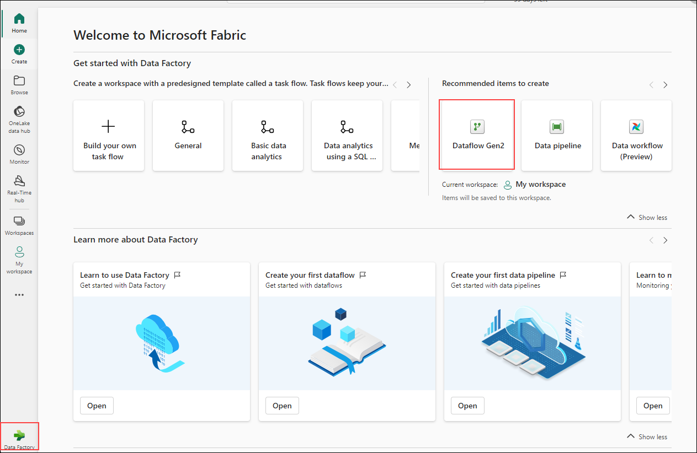
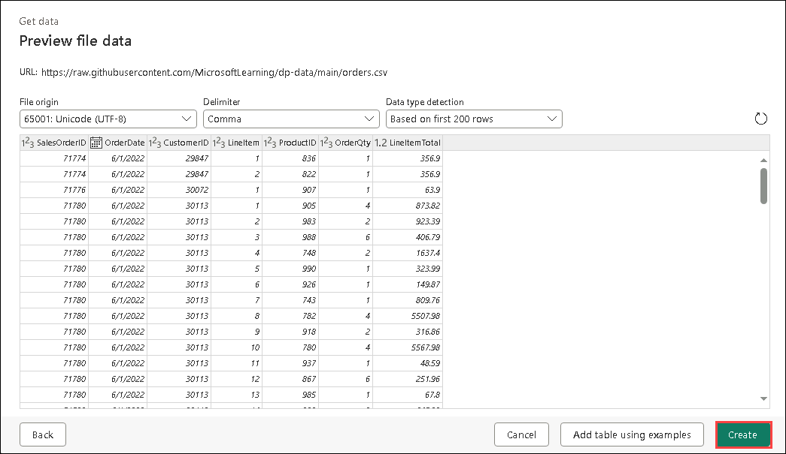
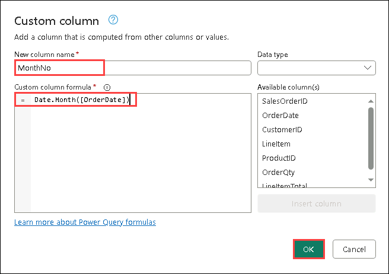
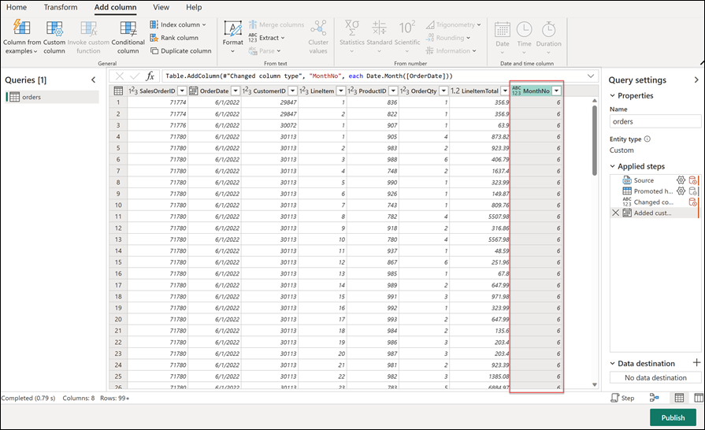
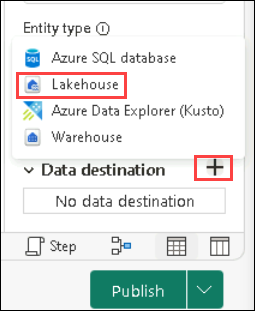
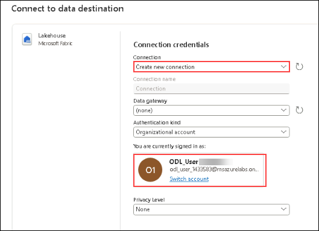
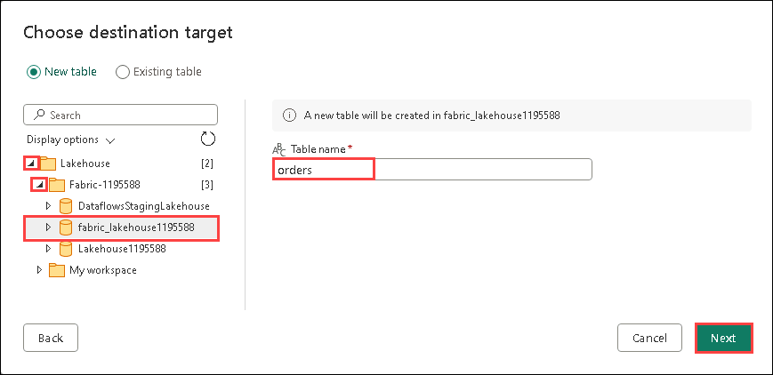
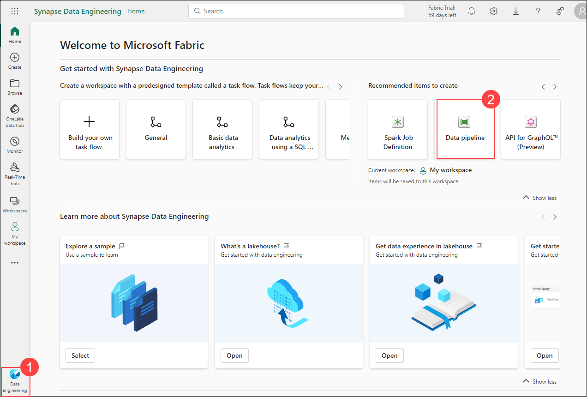
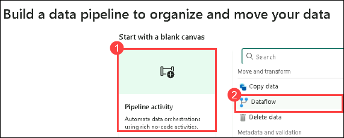
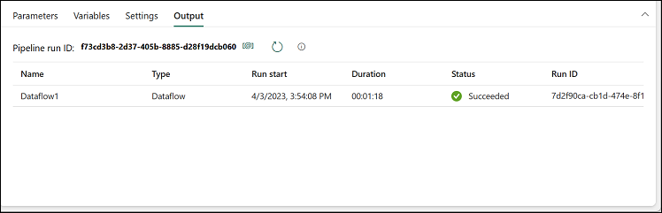

# Exercise 9: Create a Dataflow (Gen2) in Microsoft Fabric

### Estimated Duration: 30 minutes

In Microsoft Fabric, Dataflows (Gen2) connect to various data sources and perform transformations in Power Query Online. They can then be used in Data Pipelines to ingest data into a lakehouse or other analytical store or to define a dataset for a Power BI report.

This lab is designed to introduce the different elements of Dataflows (Gen2), and not create a complex solution that may exist in an enterprise.

## Lab objectives

You will be able to complete the following tasks:

- Task 1: Create a Dataflow (Gen2) to ingest data
- Task 2: Add data destination for Dataflow
- Task 3: Add a dataflow to a pipeline

### Task 1: Create a Dataflow (Gen2) to ingest data

In this task, create a Dataflow (Gen2) to efficiently ingest and transform data from various sources for analysis and processing.

1. On **fabric-<inject key="DeploymentID" enableCopy="false"/>** home page, select **New Dataflow Gen2**. After a few moments, the Power Query editor for your new dataflow will open, as illustrated below.

   

1. Select **Import from a Text/CSV file**, and create a new data source with the following settings:
    - **Link to file**: *Selected*
    - **File path or URL**: `https://raw.githubusercontent.com/MicrosoftLearning/dp-data/main/orders.csv`
    - **Connection**: Create new connection
    - **data gateway**: (none)
    - **Authentication kind**: Anonymous
    - **Privacy level**: None

1. Select **Next** to preview the file data, and then **Create** the data source. The Power Query editor shows the data source and an initial set of query steps to format the data, as shown below:

   

1. Select the **Add column** tab on the toolbar ribbon. Then, choose **Custom column** and create a new column named **MonthNo** using the formula `Date.Month([OrderDate])`.

   

1. The step to add the custom column is added to the query and the resulting column is displayed in the data pane:

   

1. Go to the **fabric_lakehouse<inject key="DeploymentID" enableCopy="false"/>** , Delete the **orders** files from the table.

### Task 2: Add data destination for Dataflow

In this task, you’ll add a data destination for the Dataflow to determine where the ingested and transformed data will be stored for future use.

1. Choose **Lakehouse** from the **Add data destination** drop-down menu.

   

   >**Note:** If this option is greyed out, you may already have a data destination set. Check the data destination at the bottom of the Query settings pane on the right side of the Power Query editor. If a destination is already set, you can change it using the gear.

2. In the **Connect to data destination** dialog box, edit the connection by selecting **Create a new connection**. Then, sign in with your Power BI organizational account to establish the identity that the dataflow will use to access the lakehouse.

   

4. Select **Next**, Select the **fabric-<inject key="DeploymentID" enableCopy="false"/>**. Choose the **lakehouse** then specify a new table named **orders**.

   

5. On the Destination settings page, observe that **MonthNo** is not selected in the Column mapping, and an informational message is displayed.
 
6. On the Destination settings page, toggle off the **Use Automatic Settings** option. Then, right-click on the **MonthNo** column header and select **Change Type** to set **MonthNo** as a **Whole number**. Finally, click on **Save Settings**.
    

5. Select **Publish** to publish the dataflow. Then wait for the **Dataflow** to be created in the workspace.

6. Once published,click on the **ellipse** next to the published dataflow in the workspace, select **Properties**, and rename the dataflow as **Transform Orders Dataflow**.

### Task 3: Add a dataflow to a pipeline

In this task, you’ll add a dataflow to a pipeline to streamline the data processing workflow and enable automated data transformations.

1. Ensure you are in the **Data Engineering** experience within the workspace. Then, select **Data pipeline** and create a new pipeline named **Load Orders pipeline**. This will open the pipeline editor.

    

   > **Note**: If the Copy Data wizard opens automatically, close it!

3. Select **pipeline activity**, and add a **Dataflow** activity to the pipeline.

   

4. With the new **Dataflow1** activity selected, go to the **Settings** tab. In the **Dataflow** drop-down list, choose **Transform Orders Dataflow**

   
   
6. **Save** the pipeline.

7. Use the **Run** button to run the pipeline, and wait for it to complete. It may take a few minutes.

   

8. In the menu bar on the left edge, select **fabric_lakehouse<inject key="DeploymentID" enableCopy="false"/>**

9. Expand the **Tables** section and select the **orders** table created by your dataflow.

   

   >**Note:** You might have to refresh the browser to get the expected output.

### Summary

In this exercise, you have created a Dataflow (Gen2) to ingest data , added data destination for Dataflow and a dataflow to a pipeline.

### You have successfully completed the lab
