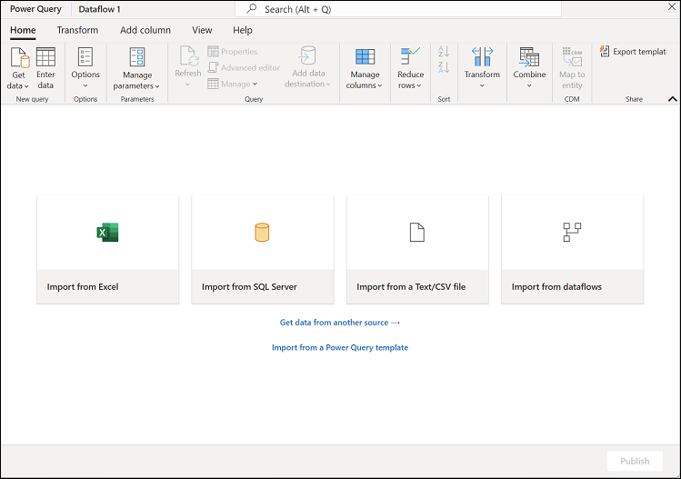
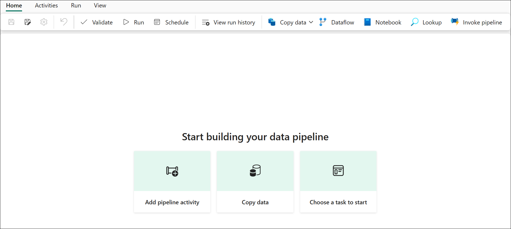
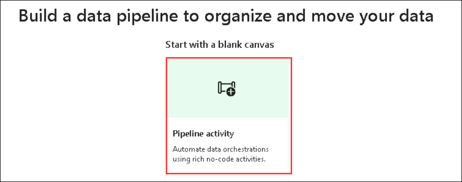
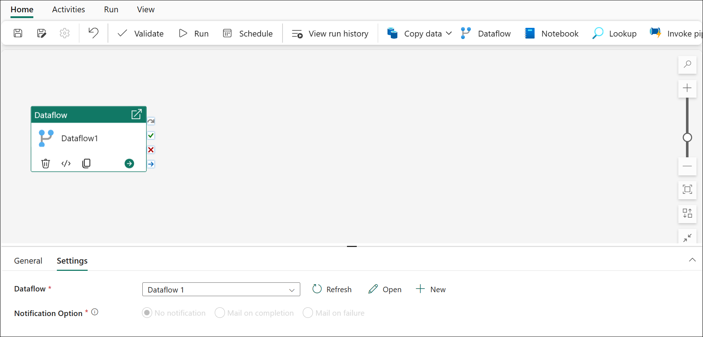
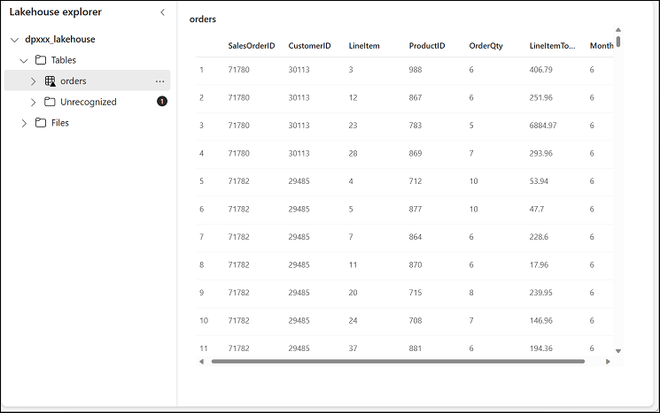

# Exercise 7: Create a Dataflow (Gen2) in Microsoft Fabric

### Estimated Duration: 30 minutes

In Microsoft Fabric, Dataflows (Gen2) connect to various data sources and perform transformations in Power Query Online. They can then be used in Data Pipelines to ingest data into a lakehouse or other analytical store or to define a dataset for a Power BI report.

This lab is designed to introduce the different elements of Dataflows (Gen2), and not create a complex solution that may exist in an enterprise.

## Lab objectives

You will be able to complete the following tasks:

- Task 1: Create a Dataflow (Gen2) to ingest data
- Task 2: Add data destination for Dataflow
- Task 3: Add a dataflow to a pipeline

### Task 1: Create a Dataflow (Gen2) to ingest data

Now that you have a lakehouse, you need to ingest some data into it. One way to do this is to define a dataflow that encapsulates an *extract, transform, and load* (ETL) process.

1. In the home page for your workspace, select **New Dataflow Gen2**. After a few seconds, the Power Query editor for your new dataflow opens as shown here.

   

   

1. Select **Import from a Text/CSV file**, and create a new data source with the following settings:
    - **Link to file**: *Selected*
    - **File path or URL**: `https://raw.githubusercontent.com/MicrosoftLearning/dp-data/main/orders.csv`
    - **Connection**: Create new connection
    - **data gateway**: (none)
    - **Authentication kind**: Anonymous

1. Select **Next** to preview the file data, and then **Create** the data source. The Power Query editor shows the data source and an initial set of query steps to format the data, as shown here:

   

1. On the toolbar ribbon, select the **Add column** tab. Then select **Custom column** and create a new column named **MonthNo** that contains a number based on the formula `Date.Month([OrderDate])` - as shown here:

   

   The step to add the custom column is added to the query and the resulting column is displayed in the data pane:

   

   > **Tip:** In the Query Settings pane on the right side, notice the **Applied Steps** include each transformation step. At the bottom, you can also toggle the **Diagram flow** button to turn on the Visual Diagram of the steps.
   >
   > Steps can be moved up or down, edited by selecting the gear icon, and you can select each step to see the transformations applied in the preview pane.

### Task 2: Add data destination for Dataflow

1. On the toolbar ribbon, select the **Home** tab. Then in the **Add data destination** drop-down menu, select **Lakehouse**.

   

   > **Note:** If this option is greyed out, you may already have a data destination set. Check the data destination at the bottom of the Query settings pane on the right side of the Power Query editor. If a destination is already set, you can change it using the gear.

2. In the **Connect to data destination** dialog box, edit the connection, choose **Create a new connection** and sign in using your Power BI organizational account to set the identity that the dataflow uses to access the lakehouse.

   

3. Select **Next** and in the list of available workspaces, find your workspace and select the lakehouse you created in it at the start of this exercise. Then specify a new table named **orders**:

   

4. On the Destination settings page, notice how **MonthNo** is not selected in the Column mapping and there is an informational message.
 
5. On the  Destination settings page toggle off the **Use Automatic Settings** option then change the data type for the MonthNo column. Right-click on the column header and **Change Type** to **MonthNo = Whole number**
and subsequently click on **Save Settings**

    

5. Select **Publish** to publish the dataflow. Then wait for the **Dataflow 4** dataflow to be created in your workspace.

6. Once published, you can click on the elipsis **...** next to the published dataflow in your workspace, select **Properties**, and rename your dataflow as **Transform Orders Dataflow**.

### Task 3: Add a dataflow to a pipeline

You can include a dataflow as an activity in a pipeline. Pipelines are used to orchestrate data ingestion and processing activities, enabling you to combine dataflows with other kinds of operations in a single, scheduled process. Pipelines can be created in a few different experiences, including the Data Factory experience.

1. From your Fabric-enabled workspace, make sure you're in the **Data Engineering** experience. Select  **Data pipeline**, then when prompted, create a new pipeline named **Load Orders pipeline**. The pipeline editor opens.

    

    

   > **Tip**: If the Copy Data wizard opens automatically, close it!

3. Select **pipeline activity**, and add a **Dataflow** activity to the pipeline.

   

4. With the new **Dataflow1** activity selected, on the **Settings** tab, in the **Dataflow** drop-down list, select **Transform Orders Dataflow** (the data flow you created previously)

   

5. On the **Home** tab, save the pipeline using the **&#128427;** **Save** icon.

6. Use the **&#9655; Run** button to run the pipeline, and wait for it to complete. It may take a few minutes.

   

7. In the menu bar on the left edge, select your lakehouse.

8. In the **...** menu for **Tables**, select **Refresh**. Then expand **Tables** and select the **orders** table, which has been created by your dataflow.

   

   >**Note:** You might have to refresh the browser to get the expected output.

### Summary

In this exercise, you have created a Dataflow (Gen2) to ingest data , added data destination for Dataflow and a dataflow to a pipeline.

### You have successfully completed the lab
