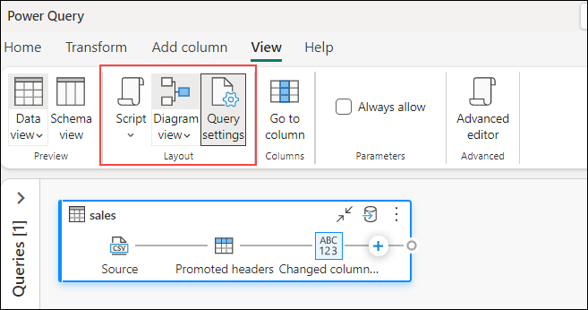

# Data Engineering Ingest Data in Fabric

 In the labs you'll create a simple data pipeline to bring in customer sales data. You are using the KiZAN Fabric Tenant - where we have Copilot enabled, demonstrate doing the same thing, but by using a new Data Flow Gen2 And leveraging the native integration of Copilot to use natural language to ingest and transform your data.
 
# Create New - Dataflow Gen2

1. In the home page for your workspace, select **New Dataflow Gen2**. After a few seconds, the Power Query editor for your new dataflow opens as shown here.

   

1. Select **Import from a Text/CSV file**, and create a new data source with the following settings:

    - **Create new connection**
    - **Link to file**: *Selected*
    - **File path or URL**: `https://raw.githubusercontent.com/MicrosoftLearning/dp-data/main/sales.csv`
    - **Connection**: Create new connection
    - **data gateway**: (none)
    - **Authentication kind**: Basic
    - Click on **Create**.

1. Click **Copilot** button on Ribbon. 

1. To better illustrate all that Copilot is doing for you, let me expand the UI a little to see what's going on behind the scenes.

1. Expand **Query Settings** (these are the steps in the query that bring in the data)

1. **View menu** : Look for the option or menu labeled "View" in the toolbar or menu bar. Click on it to reveal a dropdown menu.

1. **Diagram View** : From the dropdown menu, select "Diagram View." This will switch your view to a visual representation of your code.

1. **Script View** : Once you're in Script View, you should be able to see the M-Code that Copilot has generated. This is the underlying code representation of the actions or commands depicted in the Diagram View.

   

1. Looking at the data… Notice the Item Column.

1. This is really three different fields -- It contains a short description of the item, a color and a size.

1.	The fields are not consistently delimited (' ' and then ' ,')

1. Lets use Copilot to clean this up:

    ```
   	Add a step to the query
    ```
1. Type the following into Copilot:
 
    ```
    In the Item column, replace the ',' with ' '
    ```
 
1. The Item column now consistently has a delimiter of ' ' .

1. Show the m-code and new query step that copilot generated.
 
   ```
   Add a step to the query
   ```

1. Type the following into Copilot:
 
    ```
    Split the Item column on the ' ', creating three new fields called Description, Color and Size
    ```
 
1. Three new fields are now created to replace the Item Column
 
1. Show the m-code and new query step that copilot generated
 
   >**Note:** Copilot can do more than transform the table, we can actually change data as well.

1. Scenario: think Red bikes are going to be a big seller, so increase the quantity in Inventory
Call out that the quantities for all items are 1.
 
1. Add a step to the query

1. Type the following into Copilot:
 
    ```
    Multiply the column Quantity by 10 where Color is 'Red'
    ```
 
1. Show that the quantity field for Red bikes is now 10 instead of 1.
 
1.	Discuss the effects in the Visual Query and M-Query/M-Code script.
 
