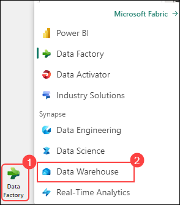

# Data Warehouse Analyze Data in a Warehouse

1. Select the workspace **fabric-2024001** (this is the workspace that mimics the lab environment)

1. Select **Data Warehouse** Object in the workspace (this is the same data warehouse students will create)

    

 
1. In the **Explorer** pane, verify that the **dbo** schema in the data warehouse contains the following four tables:
    - **DimCustomer**
    - **DimDate**
    - **DimProduct**
    - **FactSalesOrder**

        

    > **Tip**: If the schema takes a while to load, just refresh the browser page.
 
1. Clicking on **Model** allows you to view the relationships between different tables within the data warehouse.

1. When you right-click on the relationship between **FactSalesOrder** and **DimCustomer** and access its properties, you're essentially examining how these two tables are linked together. This relationship defines how data from these tables can be combined or related when querying or visualizing in Power BI.

    - This relationship indicates that each record in the "FactSalesOrder" table is associated with a specific customer represented in the "DimCustomer" table. For example, if we have a sales record in "FactSalesOrder" for a particular transaction, we can use this relationship to look up additional details about the corresponding customer from the "DimCustomer" table.

    - This linkage is crucial for defining the Semantic Model used by Power BI. The Semantic Model essentially acts as a blueprint that outlines how data elements are interconnected and how they should be interpreted within Power BI. By establishing and defining relationships between tables, we're instructing Power BI on how to navigate and analyze the data effectively.
 
1. Clicking on **New Report** allows you to create a new report within Power BI. This report will utilize the Semantic Model defined by the relationships established in the data warehouse.

1. The Semantic Model, as defined in the data warehouse, is reflected in the Power BI interface. This includes the tables and their respective fields visible in the Data Pane of Power BI, which you can use to build your reports.

1. Locate and click on the **Copilot** feature within the tool or platform you're using.

1. Look for the logo or icon representing Copilot and click on it to access its menu or interface.

1. Understand that Copilot can provide suggestions, generate code snippets, and offer explanations. However, it may have limitations such as being unable to create specific visualizations or change page layouts directly.

1. Click on **What's in my dataset**: This action triggers Copilot to analyze the Semantic model or dataset being used.

    - **Discussing Copilot's Analysis:** Once Copilot completes the analysis, review the results it provides. Copilot may offer insights into the structure of the dataset, such as the types of data present, key relationships between tables, and potential areas for analysis or visualization.

    - For example, in a simple model like the one described, Copilot might highlight that the dataset contains information about sales transactions (from "FactSalesOrder"), customer details (from "DimCustomer"), product information (from "DimProduct"), and dates (from "DimDate"). It could also identify relationships between these tables, such as how sales orders are linked to specific customers.

    - Discuss how, even in this straightforward model, Copilot's analysis can help users understand what the dataset contains and how it can be utilized. With more complex models, Copilot's insights become even more valuable in uncovering intricate relationships and patterns within the data.
    
1. **AI for Data Analysis:** Highlight the significance of Copilot as an example of AI being used not only to generate code or manipulate data but also to assist in analyzing datasets. Copilot's ability to provide intelligent insights and suggestions enhances the data analysis process and empowers users to make informed decisions based on their data.
 
1. Explore the capabilities of Copilot further by **clicking on its logo** within the text box. This will allow you to access additional features and functionalities that Copilot offers, providing a deeper understanding of its capabilities.
 
1. Click **Create a page that shows**.
   
1. At this time, you can only ask for a page or report to be created. You can't ask for specific visuals.
 
1. Type the following command into Copilot:
  
    ```
    Create a page that shows "Total Sales by Product Category"
    ```
 
1. **Execute the command** and let Copilot generate the report. Note that AI-generated results may vary, and you're never entirely sure what you'll get.
 
1. **Briefly show the generated report** to demonstrate that Copilot can build a complete report. Emphasize that while it's helpful, it might not always align perfectly with your needs.

1. **Undo or remove the generated report** to maintain clarity in the demonstration.
 
1. **Click the Copilot logo again** and select:

    ```
    Suggest Content for this Report - GO
    ```
 
1. **Expand each suggestion** to show the text of the prompt and what will be created. This helps illustrate the range of suggestions Copilot can provide.
 
1. Select **Sales Orders Trends** report as it's usually a decent report to work with. Note that the report generated can vary.
 
1. Click **Edit** to demonstrate that you can adjust the query and customize the report.

1. **Modify one of the visuals** by deleting the "DayName" field and adding "MonthName" instead. This showcases how you can adjust visuals as needed.

1. **Delete a visual that isn't helpful** to create space on the page for further customization.

1. **Add a new Narrative Visualization** in the created space and click Copilot within the visual.

1. **Clear the input box** and select:

    ```
    Executive Summary
    ```

1. **Click through the footnotes** to show where the text in the narrative comes from in the report. This demonstrates how Copilot analyzes visuals to generate text explanations.

1. **Show a bulleted list of insights** and click footnotes to illustrate where each item comes from in the report.

1. **Explain how Copilot utilizes Generative AI** to build new content from existing data, highlighting its innovative capabilities.

By following these steps, you can effectively showcase how Copilot can assist in generating reports, suggesting content, and providing insights based on your data model.
