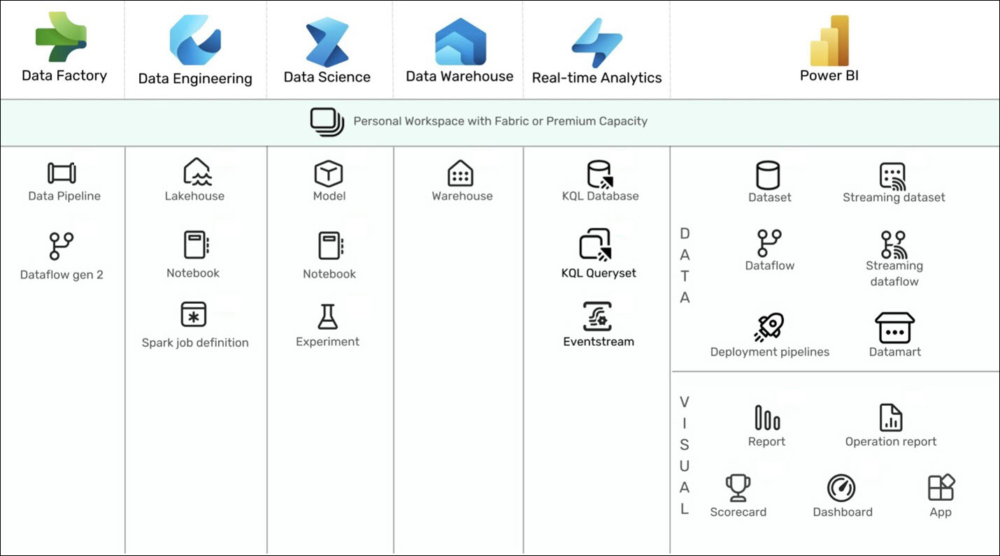
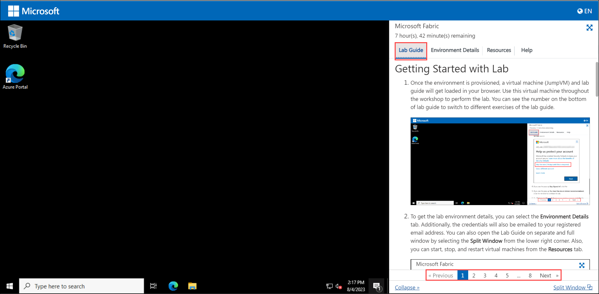
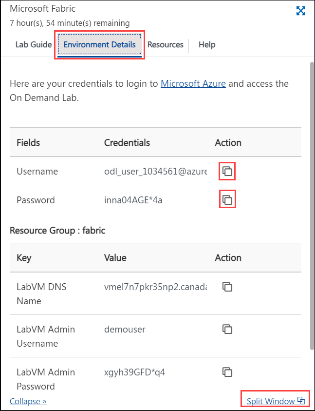
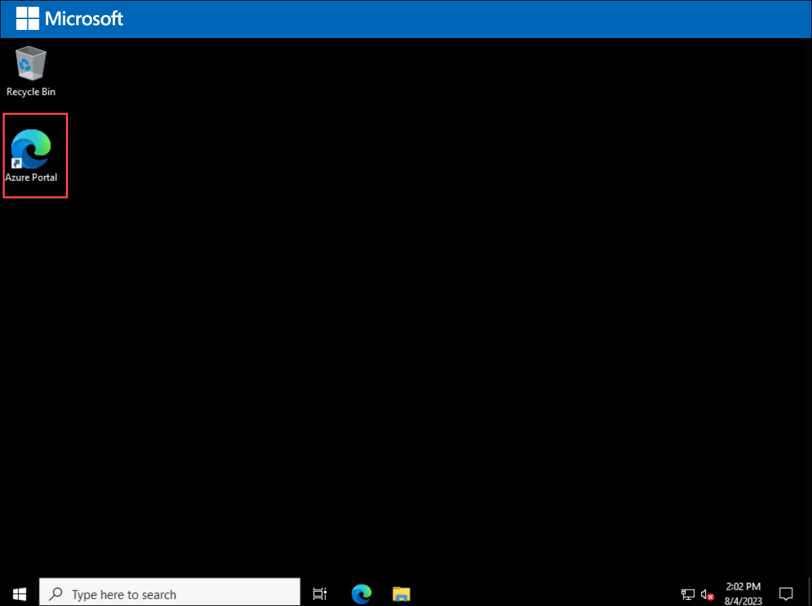
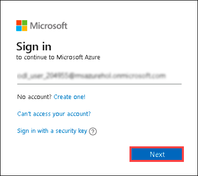
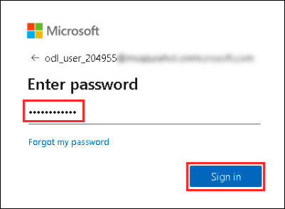

# MS Fabric Foundation for Enterprise Analytics

### Overall Estimated Duration: 8 Hours

## Overview

This lab introduces you to creating a workspace in Microsoft Fabric, a collaborative environment for organizing and managing projects, data, and resources. You will learn how to set up a workspace, create data pipelines for ETL/ELT processes, and use Apache Spark for data processing. Additionally, you will create a notebook to train a machine-learning model to predict customer churn using Scikit-Learn and MLflow. You will also explore dataflows in Microsoft Fabric to connect to various data sources, perform transformations, and define datasets for Power BI reports.

## Objective

By the end of this lab, you will be able to:

- **Create a Fabric workspace** : Learn to create and configure a collaborative workspace in Microsoft Fabric to efficiently manage projects, data, and resources.
- **Ingest data with a pipeline in Microsoft Fabric** : Implement and manage data ingestion in Microsoft Fabric using ETL/ELT pipelines and Apache Spark for scalable analytics.
- **Analyze data in a data warehouse** : Understand how Microsoft Fabric's data warehouse enables full SQL functionality, including insert, update, and delete operations, for large-scale analytics.
- **Get started with Real-Time Analytics in Microsoft Fabric** : Learn to use Microsoft Fabric’s Kusto Query Language (KQL) for efficiently storing and querying time-series data, including real-time logs and IoT information.
- **Use notebooks to train a model in Microsoft Fabric** : Learn to use Microsoft Fabric’s Kusto Query Language (KQL) for efficiently storing and querying time-series data, including real-time logs and IoT information.
- **Analyze data with Apache Spark** : You'll use Microsoft Fabric to train and track a customer churn prediction model with Scikit-Learn and MLflow.
- **Create a Dataflow (Gen2) in Microsoft Fabric** : Master Apache Spark for flexible, distributed data processing and analysis across platforms like Azure HDInsight and Databricks.
  
## Pre-requisites

- **Fundamental Knowledge of Data Engineering**: Understanding ETL/ELT and data pipelines
- **Programming Skills**: Familiarity with Python, SQL, or similar languages
- **Basic Understanding of Data Visualization**: Experience with tools like Power BI

## Architecture

In Microsoft Fabric, data flows from initial ingestion and integration into storage, followed by preparation and transformation. Once processed, it undergoes analysis for insights, with real-time data being examined immediately. The insights are then visualized through interactive reports and dashboards, while the entire system is continuously monitored to ensure performance and security.

## Architecture Diagram

  

**Explanation of the Components**:

1. **Data Factory**: The data integration service.

1. **Data Warehouse**: Lake-centric warehousing that scales compute and storage independently.
   
1. **Data Engineering**: A Spark service for designing, building, and maintaining your data estate to support data analysis.

1. **Data Science**: A service to create and deploy end-to-end data science workflows at scale

1. **Real-Time Analytics**: Cloud-based analysis of data from apps, websites, and device.

1. **Power BI**: Microsoft’s flagship business intelligence service.
   
## Getting Started with Lab

1. Once the environment is provisioned, a virtual machine (JumpVM) and lab guide will get loaded in your browser. Use this virtual machine throughout the workshop to perform the lab. You can see the number on the bottom of the **Lab guide** to switch to different exercises of the lab guide.

   

1. To get the lab environment details, you can select the **Environment Details** tab. Additionally, the credentials will also be emailed to your registered email address. You can also open the Lab Guide on separate and full windows by selecting the **Split Window** from the lower right corner. Also, you can start, stop, and restart virtual machines from the **Resources** tab.

   
 
    > You will see the DeploymentID value on the **Environment Details** tab, use it wherever you see SUFFIX or DeploymentID in lab steps.

## Login to Azure Portal

1. In the JumpVM, click on the **Azure portal** shortcut of the Microsoft Edge browser which is created on the desktop.

   
   
1. On the **Sign-in into Microsoft Azure** tab you will see the login screen, in that enter the following email/username and then click on **Next**. 
   * Email/Username: <inject key="AzureAdUserEmail"></inject>
   
     
     
1. Now enter the following password and click on **Sign in**.
   * Password: <inject key="AzureAdUserPassword"></inject>
   
     
     
   > If you see the **Help us protect your account** dialog box, then select the **Skip for now** option.

      
  
1. If you see the pop-up **Stay Signed in?**, click No

1. If you see the pop-up **You have free Azure Advisor recommendations!**, close the window to continue the lab.

1. If a **Welcome to Microsoft Azure** popup window appears, click **Maybe Later** to skip the tour.
      
1. Now, click on the **Next** from the lower right corner to move to the next page.

This hands-on-lab demonstrates how to create and manage a workspace in Microsoft Fabric, including setting up data pipelines and using Apache Spark. You’ll also train a machine-learning model and explore dataflows for Power BI reports.

## Happy Learning!!
